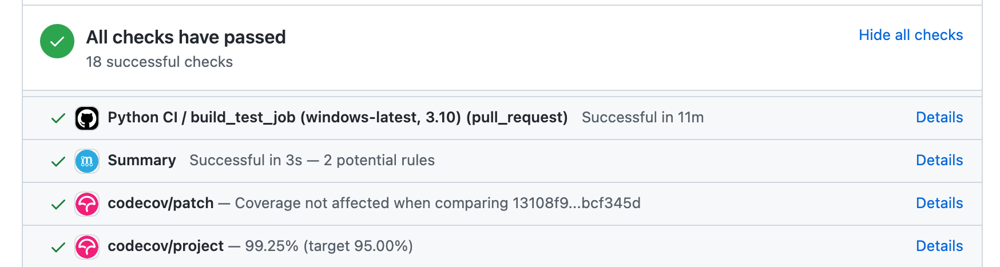

.. _contributing_codebase:

=============================
Contributing to the code base
=============================

.. contents:: Table of Contents:
   :local:

Code standards
--------------

Writing good code is not just about what you write. It is also about *how* you
write it. During :ref:`Continuous Integration <contributing.ci>` testing, several
tools will be run to check your code for stylistic errors.
Good style is a requirement for submitting code to Xorbits.

In addition, it is important that we do not make sudden changes to the code
that could have the potential to break a lot of user code as a result,
that is, we need it to be as *backwards compatible*
as possible to avoid mass breakages.

Checks (including static type checking) are run by ``pre-commit``
- see :ref:`here <contributing.pre-commit>`
for how to run them.

.. _contributing.pre-commit:

Pre-commit
----------

Additionally, :ref:`Continuous Integration <contributing.ci>` will run code formatting checks
like ``black``, ``flake8``, ``isort``, and more using `pre-commit hooks <https://pre-commit.com/>`_
Any warnings from these checks will cause the :ref:`Continuous Integration <contributing.ci>` to fail; therefore,
it is helpful to run the check yourself before submitting code. This
can be done by installing ``pre-commit``::

    pip install pre-commit

and then running::

    pre-commit install

from the root of the Xorbits repository. Now all of the styling checks will be
run each time you commit changes without your needing to run each one manually.
In addition, using ``pre-commit`` will also allow you to more easily
remain up-to-date with our code checks as they change.

Note that if needed, you can skip these checks with ``git commit --no-verify``.

If you don't want to use ``pre-commit`` as part of your workflow, you can still use it
to run its checks with::

    pre-commit run --files <files you have modified>

without needing to have done ``pre-commit install`` beforehand.

If you want to run checks on all recently committed files on upstream/main you can use::

    pre-commit run --from-ref=upstream/main --to-ref=HEAD --all-files

without needing to have done ``pre-commit install`` beforehand.

.. note::

    You may want to periodically run ``pre-commit gc``, to clean up repos
    which are no longer used.

.. note::

    If you have conflicting installations of ``virtualenv``, then you may get an
    error - see `here <https://github.com/pypa/virtualenv/issues/1875>`_.

    Also, due to a `bug in virtualenv <https://github.com/pypa/virtualenv/issues/1986>`_,
    you may run into issues if you're using conda. To solve this, you can downgrade
    ``virtualenv`` to version ``20.0.33``.

Optional dependencies
---------------------

All methods using an optional dependency should include a test asserting that an
``ImportError`` is raised when the optional dependency is not found. This test
should be skipped if the library is present.

All optional dependencies and the minimum required version should be documented in
:ref:`install.optional_dependencies`.

Backwards compatibility
-----------------------

Please try to maintain backward compatibility. If you think breakage is required,
clearly state why as part of the pull request.  Also, be careful when changing method
signatures and add deprecation warnings where needed. Also, add the deprecated sphinx
directive to the deprecated functions or methods.

You'll also need to

1. Write a new test that asserts a warning is issued when calling with the deprecated argument
2. Update all of Xorbits existing tests and code to use the new argument

.. _contributing.type_hints:

Type hints
----------

Xorbits strongly encourages the use of :pep:`484` style type hints. New development should contain type hints and pull requests to annotate existing code are accepted as well!

Style guidelines
~~~~~~~~~~~~~~~~

Type imports should follow the ``from typing import ...`` convention. Some types do not need to be imported since :pep:`585` some builtin constructs, such as ``list`` and ``tuple``, can directly be used for type annotations. So rather than

.. code-block:: python

   import typing

   primes: typing.List[int] = []

You should write

.. code-block:: python

   primes: list[int] = []

``Optional`` should be  avoided in favor of the shorter ``| None``, so instead of

.. code-block:: python

   from typing import Union

   maybe_primes: list[Union[int, None]] = []

or

.. code-block:: python

   from typing import Optional

   maybe_primes: list[Optional[int]] = []

You should write

.. code-block:: python

   from __future__ import annotations  # noqa: F404

   maybe_primes: list[int | None] = []

In some cases in the code base classes may define class variables that shadow builtins. This causes an issue as described in `Mypy 1775 <https://github.com/python/mypy/issues/1775#issuecomment-310969854>`_. The defensive solution here is to create an unambiguous alias of the builtin and use that without your annotation. For example, if you come across a definition like

.. code-block:: python

   class SomeClass1:
       str = None

The appropriate way to annotate this would be as follows

.. code-block:: python

   str_type = str

   class SomeClass2:
       str: str_type = None

Validating type hints
~~~~~~~~~~~~~~~~~~~~~

Xorbits uses `mypy <http://mypy-lang.org>`_ and `pyright <https://github.com/microsoft/pyright>`_ to statically analyze the code base and type hints. After making any change you can ensure your type hints are correct by running

.. code-block:: shell

    # the following might fail if the installed Xorbits version does not correspond to your local git version
    pre-commit run --hook-stage manual --all-files

    # if the above fails due to stubtest
    SKIP=stubtest pre-commit run --hook-stage manual --all-files

in your activated python environment. A recent version of ``numpy`` (>=1.22.0) is required for type validation.

.. _contributing.ci:

Testing with continuous integration
-----------------------------------

The Xorbits test suite will run automatically on `GitHub Actions <https://github.com/features/actions/>`__
continuous integration services, once your pull request is submitted.
However, if you wish to run the test suite on a branch prior to submitting the pull request,
then the continuous integration services need to be hooked to your GitHub repository. Instructions are here
for `GitHub Actions <https://docs.github.com/en/actions/>`__.

A pull-request will be considered for merging when you have an all 'green' build. If any tests are failing,
then you will get a red 'X', where you can click through to see the individual failed tests.
This is an example of a green build.

.. _contributing.tdd:

Test-driven development
-----------------------

Xorbits is serious about testing and strongly encourages contributors to embrace
`test-driven development (TDD) <https://en.wikipedia.org/wiki/Test-driven_development>`_.
This development process "relies on the repetition of a very short development cycle:
first the developer writes an (initially failing) automated test case that defines a desired
improvement or new function, then produces the minimum amount of code to pass that test."
So, before actually writing any code, you should write your tests.  Often the test can be
taken from the original GitHub issue.  However, it is always worth considering additional
use cases and writing corresponding tests.

Adding tests is one of the most common requests after code is pushed to Xorbits.  Therefore,
it is worth getting in the habit of writing tests ahead of time so this is never an issue.

Writing tests
~~~~~~~~~~~~~

All tests should go into the ``tests`` subdirectory of the specific package.
This folder contains many current examples of tests, and we suggest looking to these for
inspiration.

As a general tip, you can use the search functionality in your integrated development
environment (IDE) or the git grep command in a terminal to find test files in which the method
is called. If you are unsure of the best location to put your test, take your best guess,
but note that reviewers may request that you move the test to a different location.

To use git grep, you can run the following command in a terminal:

``git grep "function_name("``

This will search through all files in your repository for the text ``function_name(``.
This can be a useful way to quickly locate the function in the
codebase and determine the best location to add a test for it.

Ideally, there should be one, and only one, obvious place for a test to reside.
Until we reach that ideal, these are some rules of thumb for where a test should
be located.

Using ``pytest``
~~~~~~~~~~~~~~~~

Test structure
^^^^^^^^^^^^^^

We prefer a more *functional* style using the `pytest <https://docs.pytest.org/en/latest/>`__ framework, which offers a richer testing
framework that will facilitate testing and developing. Thus, instead of writing test classes, we will write test functions like this:

.. code-block:: python

    def test_really_cool_feature():
        pass

Preferred ``pytest`` idioms
^^^^^^^^^^^^^^^^^^^^^^^^^^^

* Functional tests named ``def test_*`` and *only* take arguments that are either fixtures or parameters.
* Use a bare ``assert`` for testing scalars and truth-testing
* Use ``tm.assert_series_equal(result, expected)`` and ``tm.assert_frame_equal(result, expected)`` for comparing :class:`Series` and :class:`DataFrame` results respectively.
* Use `@pytest.mark.parameterize <https://docs.pytest.org/en/latest/how-to/parametrize.html>`__ when testing multiple cases.
* Use `pytest.mark.xfail <https://docs.pytest.org/en/latest/reference/reference.html?#pytest.mark.xfail>`__ when a test case is expected to fail.
* Use `pytest.mark.skip <https://docs.pytest.org/en/latest/reference/reference.html?#pytest.mark.skip>`__ when a test case is never expected to pass.
* Use `pytest.param <https://docs.pytest.org/en/latest/reference/reference.html?#pytest-param>`__ when a test case needs a particular mark.
* Use `@pytest.fixture <https://docs.pytest.org/en/latest/reference/reference.html?#pytest-fixture>`__ if multiple tests can share a setup object.

.. warning::

    Do not use ``pytest.xfail`` (which is different than ``pytest.mark.xfail``) since it immediately stops the
    test and does not check if the test will fail. If this is the behavior you desire, use ``pytest.skip`` instead.

If a test is known to fail but the manner in which it fails
is not meant to be captured, use ``pytest.mark.xfail`` It is common to use this method for a test that
exhibits buggy behavior or a non-implemented feature. If
the failing test has flaky behavior, use the argument ``strict=False``. This
will make it so pytest does not fail if the test happens to pass.

Prefer the decorator ``@pytest.mark.xfail`` and the argument ``pytest.param``
over usage within a test so that the test is appropriately marked during the
collection phase of pytest. For xfailing a test that involves multiple
parameters, a fixture, or a combination of these, it is only possible to
xfail during the testing phase. To do so, use the ``request`` fixture:

.. code-block:: python

    def test_xfail(request):
        mark = pytest.mark.xfail(raises=TypeError, reason="Indicate why here")
        request.node.add_marker(mark)

xfail is not to be used for tests involving failure due to invalid user arguments.
For these tests, we need to verify the correct exception type and error message
is being raised, using ``pytest.raises`` instead.

.. _contributing.warnings:

Testing a warning
^^^^^^^^^^^^^^^^^

Use ``tm.assert_produces_warning`` as a context manager to check that a block of code raises a warning.

.. code-block:: python

    with tm.assert_produces_warning(DeprecationWarning):
        pd.deprecated_function()

If a warning should specifically not happen in a block of code, pass ``False`` into the context manager.

.. code-block:: python

    with tm.assert_produces_warning(False):
        pd.no_warning_function()

If you have a test that would emit a warning, but you aren't actually testing the
warning itself (say because it's going to be removed in the future, or because we're
matching a 3rd-party library's behavior), then use ``pytest.mark.filterwarnings`` to
ignore the error.

.. code-block:: python

    @pytest.mark.filterwarnings("ignore:msg:category")
    def test_thing(self):
        pass

If you need finer-grained control, you can use Python's
`warnings module <https://docs.python.org/3/library/warnings.html>`__
to control whether a warning is ignored or raised at different places within
a single test.

.. code-block:: python

    with warnings.catch_warnings():
        warnings.simplefilter("ignore", FutureWarning)

Testing an exception
^^^^^^^^^^^^^^^^^^^^

Use `pytest.raises <https://docs.pytest.org/en/latest/reference/reference.html#pytest-raises>`_ as a context manager
with the specific exception subclass (i.e. never use :py:class:`Exception`) and the exception message in ``match``.

.. code-block:: python

    with pytest.raises(ValueError, match="an error"):
        raise ValueError("an error")

Testing involving files
^^^^^^^^^^^^^^^^^^^^^^^

The ``tm.ensure_clean`` context manager creates a temporary file for testing,
with a generated filename (or your filename if provided), that is automatically
deleted when the context block is exited.

.. code-block:: python

    with tm.ensure_clean('my_file_path') as path:
        # do something with the path

Testing involving network connectivity
^^^^^^^^^^^^^^^^^^^^^^^^^^^^^^^^^^^^^^

It is highly discouraged to add a test that connects to the internet due to flakiness of network connections and
lack of ownership of the server that is being connected to. If network connectivity is absolutely required, use the
``tm.network`` decorator.

.. code-block:: python

    @tm.network   # noqa
    def test_network():
        result = package.call_to_internet()

If the test requires data from a specific website, specify ``check_before_test=True`` and the site in the decorator.

.. code-block:: python

    @tm.network("https://www.somespecificsite.com", check_before_test=True)
    def test_network():
        result = pd.read_html("https://www.somespecificsite.com")

.. _contributing.running_tests:

Running the test suite
----------------------

The tests can then be run directly inside your Git clone (without having to
install Xorbits) by typing::

    pytest python/xorbits

.. note::

    If a handful of tests don't pass, it may not be an issue with your Xorbits installation.
    Some tests (e.g. some SQLAlchemy ones) require additional setup, others might start
    failing because a non-pinned library released a new version, and others might be flaky
    if run in parallel. As long as you can import Xorbits from your locally built version,
    your installation is probably fine and you can start contributing!

Often it is worth running only a subset of tests first around your changes before running the
entire suite.

The easiest way to do this is with::

    pytest xorbits/python/path/to/test.py -k regex_matching_test_name

Or with one of the following constructs::

    pytest xorbits/python/tests/[test-module].py
    pytest xorbits/python/tests/[test-module].py::[TestClass]
    pytest xorbits/python/tests/[test-module].py::[TestClass]::[test_method]

The ``-r`` report flag will display a short summary info (see `pytest
documentation <https://docs.pytest.org/en/4.6.x/usage.html#detailed-summary-report>`_)
. Here we are displaying the number of:

- s: skipped tests
- x: xfailed tests
- X: xpassed tests

The summary is optional and can be removed if you don't need the added
information. Using the parallelization option can significantly reduce the
time it takes to locally run tests before submitting a pull request.

For more, see the `pytest <https://docs.pytest.org/en/latest/>`_ documentation.

Documenting your code
---------------------

When mentioning parts of the API, use a Sphinx ``:func:``, ``:meth:``, or ``:class:``
directive as appropriate. Not all public API functions and methods have a
documentation page; ideally links would only be added if they resolve. You can
usually find similar examples by checking the release notes for one of the previous
versions.

If your code is a bugfix, add your entry to the relevant bugfix section. Avoid
adding to the ``Other`` section; only in rare cases should entries go there.
Being as concise as possible, the description of the bug should include how the
user may encounter it and an indication of the bug itself, e.g.
"produces incorrect results" or "incorrectly raises". It may be necessary to also
indicate the new behavior.

If your code is an enhancement, it is most likely necessary to add usage
examples to the existing documentation.  This can be done following the section
regarding :ref:`documentation <contributing_documentation>`.
Further, to let users know when this feature was added, the ``versionadded``
directive is used. The sphinx syntax for that is:

.. code-block:: rst

  .. versionadded:: 0.1.0

This will put the text *New in version 0.1.0* wherever you put the sphinx
directive. This should also be put in the docstring when adding a new function
or method or a new keyword argument.