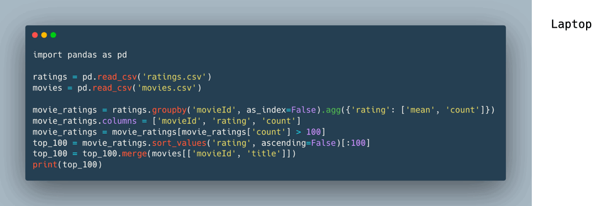

.. _index:

.. raw:: html

    

====

Welcome to Xorbits!
"""""""""""""""""""

Xorbits is an open-source computing framework that makes it easy to scale data science and machine learning workloads —
from data loading to preprocessing, tuning, training, and model serving. Xorbits can leverage multi cores or GPUs to accelerate
computation on a single machine, or scale out up to thousands of machines to support processing terabytes of data.

Xorbits provides a suite of best-in-class libraries for data scientists and machine learning practitioners. Xorbits provides
the capability to scale tasks without the necessity for extensive knowledge of infrastructure.

- :ref:`Xorbits Data <xorbits_data_index>`: Load and process datasets, from small to large, using the tools you love💜, such as pandas and Numpy.

- :ref:`Xorbits Train <xorbits_train_index>`: Train your own state-of-the-art models for ML and DL frameworks such as PyTorch, XGBoost, etc.

- :ref:`Xorbits Tune <xorbits_tune_index>`: Finetune your models by running state of the art algorithms such as PEFT.

- :ref:`Xorbits Inference <xorbits_inference_index>`: Scalable serving to deploy state-of-the-art models. Integrate with the most popular deep learning libraries, like PyTorch, ggml, etc.

Xorbits features a familiar Python API that supports a variety of libraries, including pandas, NumPy, scikit-learn, PyTorch,
XGBoost, Xarray, etc. With a simple modification of just one line of code, your pandas workflow can be seamlessly scaled using
Xorbits:

As for the name of ``xorbits``, it has many meanings, you can treat it as ``X-or-bits`` or ``X-orbits`` or ``xor-bits``,
just have fun to comprehend it in your own way.

Getting involved
----------------

.. only:: not zh_cn

    +--------------------------------------------------------------------------------------------------+----------------------------------------------------+
    | **Platform**                                                                                     | **Purpose**                                        |
    +--------------------------------------------------------------------------------------------------+----------------------------------------------------+
    | `Discourse Forum <https://discuss.xorbits.io/>`_                                                 | Asking usage questions and discussing development. |
    +--------------------------------------------------------------------------------------------------+----------------------------------------------------+
    | `Github Issues <https://github.com/xorbitsai/xorbits/issues>`_                                   | Reporting bugs and filing feature requests.        |
    +--------------------------------------------------------------------------------------------------+----------------------------------------------------+
    | `Slack <https://join.slack.com/t/xorbitsio/shared_invite/zt-1o3z9ucdh-RbfhbPVpx7prOVdM1CAuxg>`_  | Collaborating with other Xorbits users.            |
    +--------------------------------------------------------------------------------------------------+----------------------------------------------------+
    | `StackOverflow <https://stackoverflow.com/questions/tagged/xorbits>`_                            | Asking questions about how to use Xorbits.         |
    +--------------------------------------------------------------------------------------------------+----------------------------------------------------+
    | `Twitter <https://twitter.com/xorbitsio>`_                                                       | Staying up-to-date on new features.                |
    +--------------------------------------------------------------------------------------------------+----------------------------------------------------+

.. only:: zh_cn

    +--------------------------------------------------------------------------------------------------+----------------------------------------------------+
    | **Platform**                                                                                     | **Purpose**                                        |
    +--------------------------------------------------------------------------------------------------+----------------------------------------------------+
    | `Github Issues <https://github.com/xorbitsai/xorbits/issues>`_                                   | Reporting bugs and filing feature requests.        |
    +--------------------------------------------------------------------------------------------------+----------------------------------------------------+
    | `Gitee Issues <https://gitee.com/xorbitsai/xorbits/issues>`_                                     | Reporting bugs and filing feature requests.        |
    +--------------------------------------------------------------------------------------------------+----------------------------------------------------+

    Visit `Xorbits community <https://xorbits.cn/community>`_ to join us on Wechat, Zhihu and so on.

.. toctree::
   :maxdepth: 2
   :hidden:

   getting_started/index
   libraries/index
   user_guide/index
   deployment/index
   reference/index
   development/index
